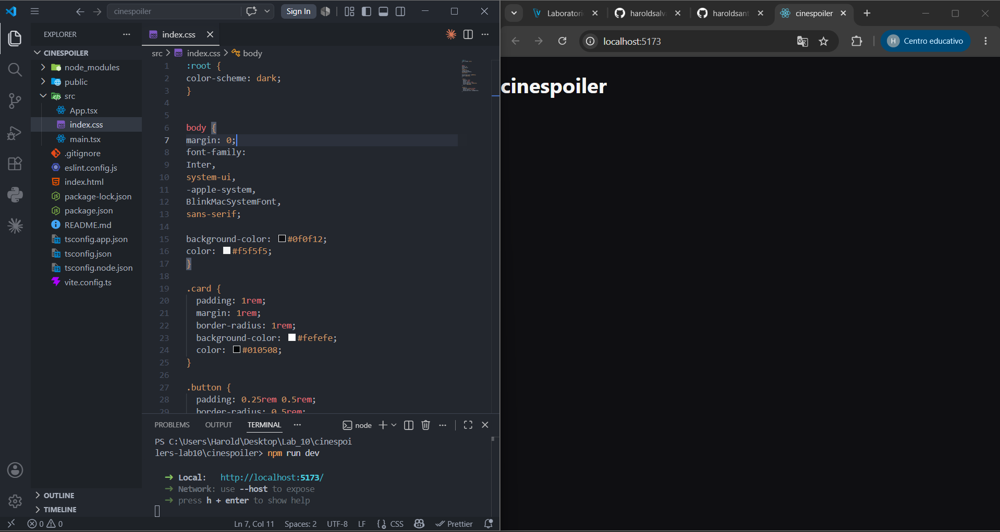
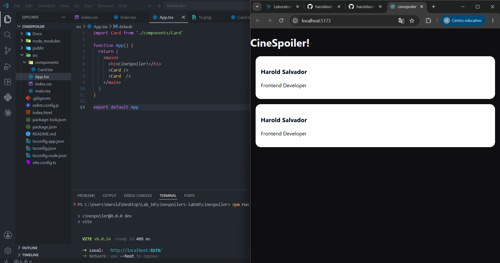
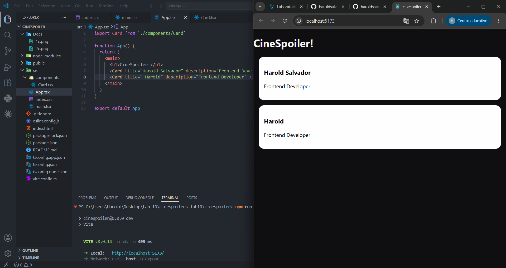
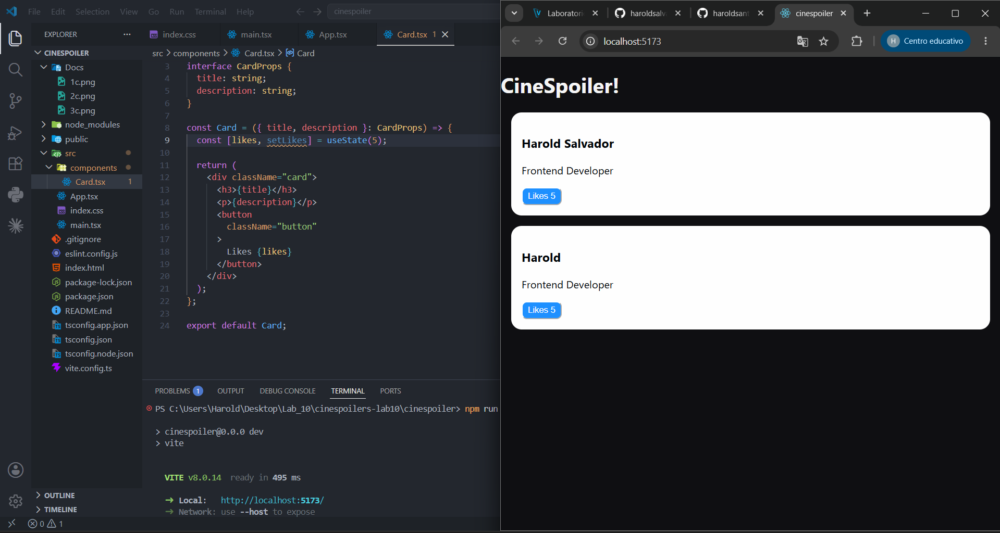
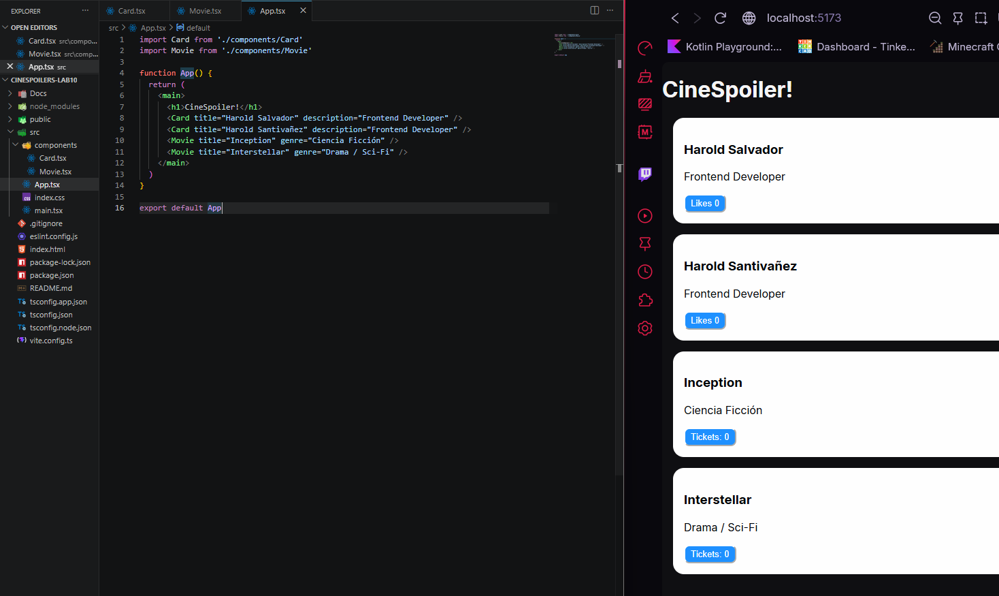
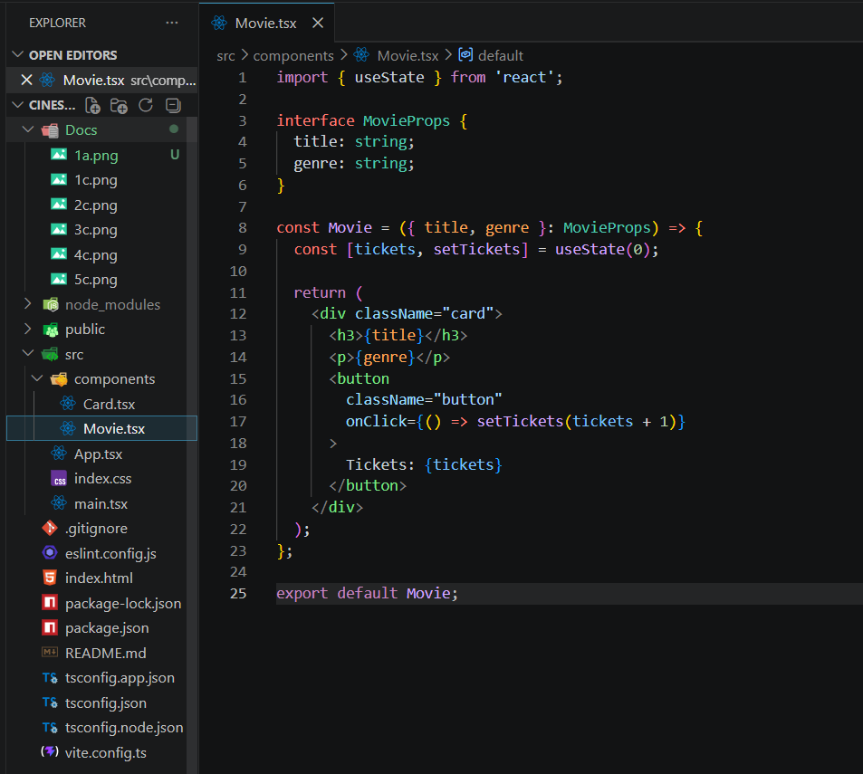
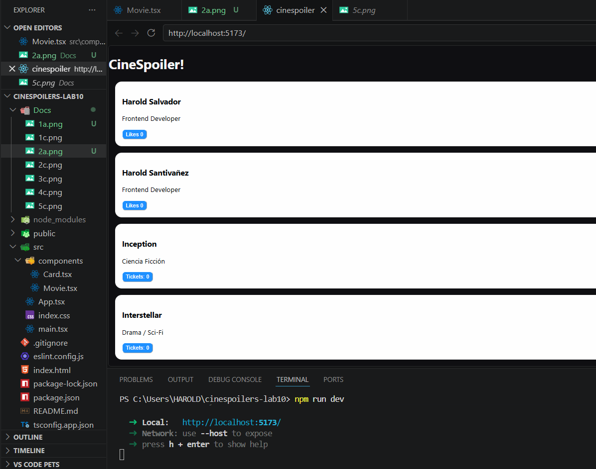
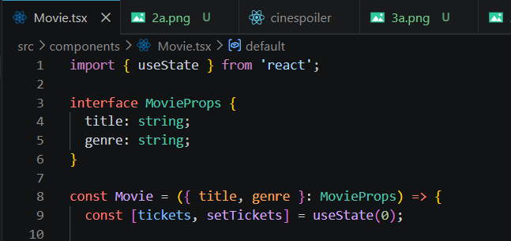
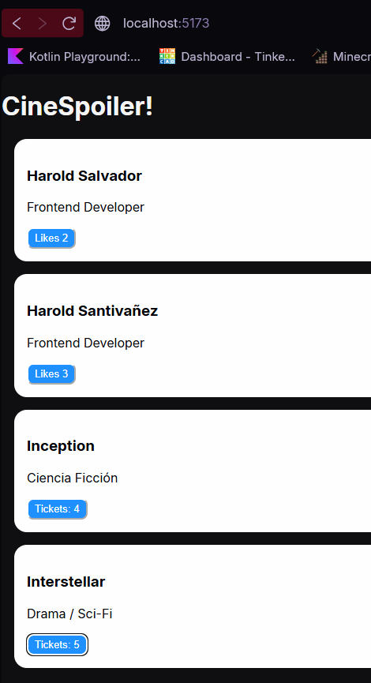

# Laboratorio 10
## INTEGRANTES
## Harold Salvador - Harold Santivañez

### Ingredientes: Harold David Salvador Zarate - Lab 10

## Proyecto Limpio

## Componente Card

## Componente con Props

## Estado en el componente

## Manejo de estados mediante eventos

# Ingredientes: Harold Eduardo Santivañez

## Proyecto limpio, renderizado y sin errores

## Creación de componente con variables y uso.

## Props en el componente creado

## Estado en el componente

## Manejo de estado mediante eventos
